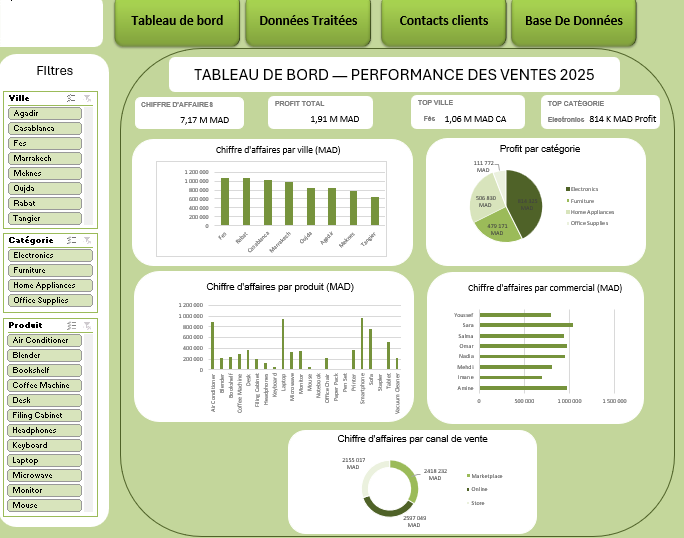

# Tableau de bord des performances commerciales | Excel

## Présentation du projet

Ce projet présente un tableau de bord Excel interactif pour analyser les ventes d'une entreprise à partir de données transactionnelles de 2025. Il permet de suivre le chiffre d'affaires, le profit et les performances par ville, catégorie, produit, commercial et canal de vente.

**Outil :** Microsoft Excel  
**Devise :** dirham marocain (MAD)  
**Période :** 2025  
**Données :** 995 commandes après nettoyage.

## Objectifs

- Préparer et nettoyer les données de ventes.
- Construire des tableaux croisés dynamiques (TCD) pour synthétiser les résultats.
- Suivre les indicateurs clés de performance (KPI).
- Comparer les ventes selon plusieurs dimensions commerciales.
- Faciliter l'exploration des résultats grâce à des segments interactifs.

## Préparation des données

Les données ont été contrôlées et nettoyées, notamment pour les doublons et les valeurs manquantes. Les calculs de chiffre d'affaires et de profit servent de base aux analyses.

## Tableau de bord

Le tableau de bord comprend quatre KPI : chiffre d'affaires total, profit total, ville principale en chiffre d'affaires et catégorie principale en profit.

Il présente cinq visualisations :

1. Chiffre d'affaires par ville.
2. Profit par catégorie.
3. Chiffre d'affaires par produit.
4. Chiffre d'affaires par commercial.
5. Chiffre d'affaires par canal de vente.

Des segments **Ville**, **Catégorie** et **Produit** permettent de filtrer les analyses liées aux TCD.

## Résultats clés

- Chiffre d'affaires total : environ **7,17 M MAD**.
- Profit total : environ **1,91 M MAD**.
- Ville avec le chiffre d'affaires le plus élevé : **Fès**.
- Catégorie avec le profit le plus élevé : **Electronics**.

Ces résultats décrivent uniquement le jeu de données étudié ; ils ne constituent pas une estimation du marché.

## Compétences mobilisées

Excel · Nettoyage de données · Formules · Tableaux croisés dynamiques · Graphiques croisés dynamiques · Segments · KPI · Reporting commercial · Data visualisation

## Fichiers du projet

- `Excel_Sales_Performance_Dashboard.xlsx` : classeur Excel contenant les données, les analyses et le tableau de bord interactif.
- `Excel_Sales_Performance_Dashboard.png` : capture d'écran du tableau de bord final.

> Pour utiliser les segments et les graphiques interactifs, ouvrir le classeur dans Microsoft Excel. La capture d'écran permet de consulter le tableau de bord directement sur GitHub.
> ## Aperçu du tableau de bord

